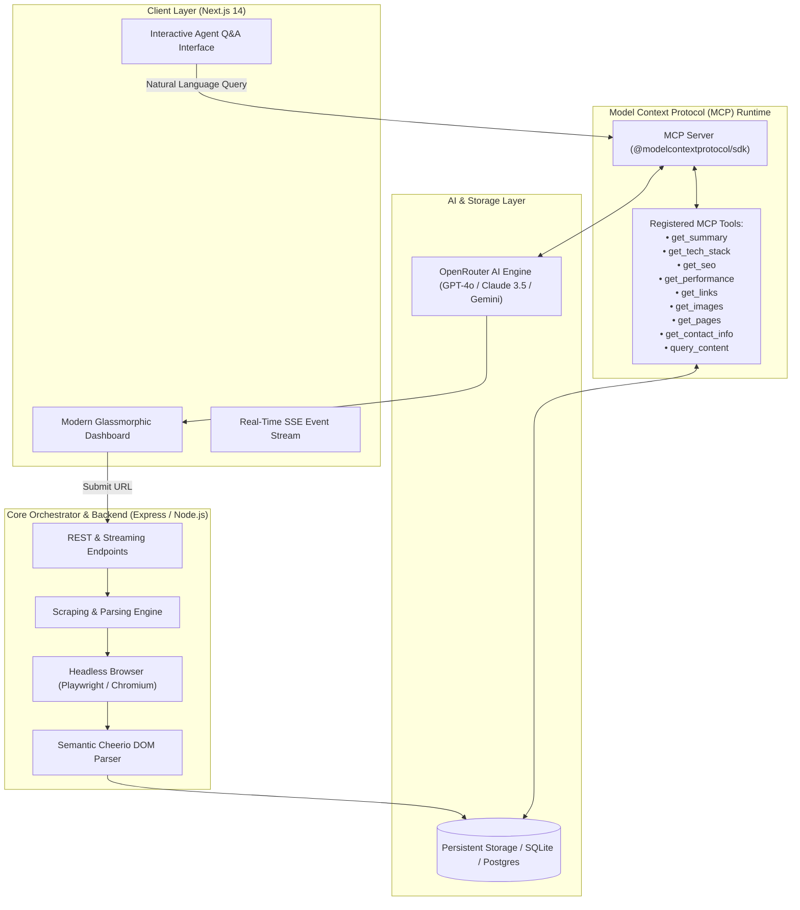

<div align="center">

# 🌐 ArgusMCP
### Autonomous Web Intelligence via the Model Context Protocol

[](https://www.typescriptlang.org/)
[](https://nextjs.org/)
[](https://modelcontextprotocol.io/)
[](https://playwright.dev/)
[](https://opensource.org/licenses/MIT)

**ArgusMCP** is a research-grade, agentic web analysis platform built on the open **Model Context Protocol (MCP)** standard. Designed for researchers, software engineers, and automated auditing pipelines, ArgusMCP orchestrates headless browser rendering, deep structural parsing, and autonomous LLM agents to deliver comprehensive web intelligence.

[Quick Start](#-quick-start) • [Architecture](#-system-architecture) • [MCP Tool Specification](#-mcp-tool-specification) • [Academic Citation](#-citation)

---

</div>

## 📑 Table of Contents
- [Executive Overview](#-executive-overview)
- [System Architecture](#-system-architecture)
- [Key Features](#-key-features)
- [Model Context Protocol (MCP) Integration](#-model-context-protocol-mcp-integration)
- [MCP Tool Specification](#-mcp-tool-specification)
- [Directory Structure](#-directory-structure)
- [Quick Start & Installation](#-quick-start)
- [API Endpoints](#-api-endpoints)
- [Research & Industry Use Cases](#-research--industry-use-cases)
- [Citation](#-citation)
- [License](#-license)

---

## 🎯 Executive Overview

Modern web applications are increasingly complex, relying on client-side rendering (CSR), dynamic Single Page Application (SPA) state machines, obfuscated bundles, and asynchronous network hydration. Traditional regex-based scrapers fail to capture runtime DOM representations, while conventional SEO tools lack semantic context understanding.

**ArgusMCP** bridges this gap by unifying:
1. **Dynamic Headless Execution**: Full JavaScript evaluation via Chromium and Playwright to capture the hydrated DOM and computed styles.
2. **Standardized Tool Protocol (MCP)**: Exposes discrete analytical tools conforming to the official Model Context Protocol (`@modelcontextprotocol/sdk`).
3. **Agentic LLM Reasoning**: Autonomous synthesis using state-of-the-art LLMs (via OpenRouter) capable of contextual question-answering, security posture analysis, and technical audits.

---

## 🏗 System Architecture



---

## ✨ Key Features

- **Protocol-First Design (MCP)**: Implements Anthropic's Model Context Protocol, decoupling scraping and analytical primitives into reusable, secure tool calls.
- **Deep SPA & Dynamic Hydration**: Bypasses anti-bot hurdles, executes client-side scripts, and waits for network idle states to inspect dynamic React, Vue, Angular, and Next.js applications.
- **Automated Technology Fingerprinting**: Identifies frontend frameworks, CMS engines, analytics trackers, CDN routing, and backend signatures via headers and script telemetry.
- **Exhaustive SEO & Semantic Hierarchy Audit**: Evaluates Open Graph tags, Twitter cards, meta robots, canonical constraints, heading trees ($H_1 \to H_6$), and readability metrics.
- **Network Graph & Link Topology**: Partitions internal vs. external hyperlinks, detects broken references, and extracts contact metadata (cryptographic hashes, social handles, mailto).
- **Interactive Conversational Grounding**: Integrated chat agent powered by MCP `query_content` and `get_*` primitives to answer natural-language queries about any analyzed domain with zero hallucinations.

---

## 🔌 Model Context Protocol (MCP) Integration

ArgusMCP registers tool definitions through the official `@modelcontextprotocol/sdk`. This allows any MCP-compatible client (such as Claude Desktop, Cursor, or autonomous agent runtimes) to inspect and reason over web artifacts natively.

```typescript
// Example: Querying ArgusMCP via MCP Client Tool Call
{
  "name": "query_content",
  "arguments": {
    "siteId": "9b1deb4d-3b7d-4bad-9bdd-2b0d7b3dcb6d",
    "query": "What payment gateways are mentioned on the checkout flow?"
  }
}
```

---

## 🛠 MCP Tool Specification

| Tool Name | Parameters | Description |
| :--- | :--- | :--- |
| `get_summary` | `siteId: string` | Synthesizes an executive overview and structural analysis of the domain. |
| `get_tech_stack` | `siteId: string` | Returns detected frameworks, UI libraries, analytics, and server environments. |
| `get_seo` | `siteId: string` | Audits meta tags, title lengths, semantic headings, and social metadata. |
| `get_performance` | `siteId: string` | Computes response latency, DOM node volume, and resource transfer weights. |
| `get_links` | `siteId: string, type: "internal" \| "external" \| "all"` | Traverses and categorizes internal routing links and outbound references. |
| `get_images` | `siteId: string` | Audits image assets, dimensions, format modernness, and missing `alt` accessibility tags. |
| `get_pages` | `siteId: string` | Returns the multi-page crawl topology and sitemap discovery endpoints. |
| `get_contact_info` | `siteId: string` | Extracts validated email addresses, telephone numbers, and corporate social handles. |
| `query_content` | `siteId: string, query: string` | Executes semantic search across raw text extractions using LLM context embedding. |

---

## 📁 Directory Structure

```text
ArgusMCP/
├── frontend/                     # Next.js 14 Web Application
│   ├── app/                      # App Router (Pages, Layouts, Server Components)
│   │   ├── analyze/[id]/         # Real-time Analysis Dashboard & Insights
│   │   ├── page.tsx              # ArgusMCP Hero & URL Intake
│   │   └── layout.tsx            # Global Root Layout & Metadata
│   ├── components/               # Modular UI Components
│   │   ├── AnalysisDashboard.tsx # Multi-tab Audit Visualizer
│   │   ├── ChatInterface.tsx     # Conversational MCP Agent Panel
│   │   ├── Navbar.tsx            # Navigation & Engine Health Telemetry
│   │   └── UrlInput.tsx          # URL Validation & Analysis Trigger
│   └── package.json
│
├── mcp_backend/                  # Express & Model Context Protocol Backend
│   ├── src/
│   │   ├── analyzer.ts           # Playwright Crawler & Cheerio Extractor
│   │   ├── aiClient.ts           # OpenRouter LLM Integration & Grounded Search
│   │   ├── db.ts                 # Persistent Database Adapter & Query Layer
│   │   ├── server.ts             # Express Server, SSE Streamer & MCP Handlers
│   │   ├── routes/               # Modular REST Endpoints
│   │   └── tools/                # Formal MCP Tool Implementations
│   └── package.json
│
├── docker-compose.yml            # Containerized Database Infrastructure
├── package.json                  # Root Monorepo Configuration (Concurrently Runner)
├── start.bat                     # Windows 1-Click Launch Script
└── README.md                     # Technical Documentation
```

---

## 🚀 Quick Start

### 1. Prerequisites
- **Node.js**: `v18.0.0` or higher (tested on `v20+` and `v24+`)
- **npm**: `v9.0.0` or higher
- **Git**: For version control

### 2. Clone the Repository
```bash
git clone https://github.com/rasel1510/ArgusMCP.git
cd ArgusMCP
```

### 3. Configure Environment Variables

**Backend (`mcp_backend/.env`):**
```bash
cd mcp_backend
cp .env.example .env
```
Provide your OpenRouter API key:
```env
PORT=4000
OPENROUTER_API_KEY=your_openrouter_api_key_here
AI_MODEL=openai/gpt-4o-mini
FRONTEND_URL=http://localhost:3000
```

**Frontend (`frontend/.env.local`):**
```bash
cd ../frontend
cp .env.example .env.local
```
Ensure the API endpoint is targeted:
```env
NEXT_PUBLIC_API_URL=http://localhost:4000
```

### 4. Install Dependencies

From the project root:
```bash
# Install root dependencies
npm install

# Install backend dependencies & Playwright Chromium binaries
cd mcp_backend
npm install
npx playwright install chromium

# Install frontend dependencies
cd ../frontend
npm install
cd ..
```

### 5. Running the Application

#### Option A: Unified Monorepo Runner (Recommended)
From the project root:
```bash
npm run dev
```
*Spawns both backend (`http://localhost:4000`) and frontend (`http://localhost:3000`) with unified color-coded logging.*

#### Option B: Windows 1-Click Launch
Double-click `start.bat` or run in PowerShell:
```powershell
.\start.bat
```

#### Option C: Manual Multi-Terminal Launch
```bash
# Terminal 1: Backend
npm run dev:backend

# Terminal 2: Frontend
npm run dev:frontend
```

Open **[http://localhost:3000](http://localhost:3000)** in your browser.

---

## 🌐 API Endpoints

| Method | Route | Description |
| :--- | :--- | :--- |
| `POST` | `/api/analyze` | Initiates an asynchronous crawl & audit job for a target URL. |
| `GET` | `/api/analyze/:id/status` | SSE (Server-Sent Events) live progress updates. |
| `GET` | `/api/sites/:id` | Returns complete structured analytical results for a domain. |
| `POST` | `/api/chat` | Conversational query endpoint utilizing registered MCP tools. |
| `GET` | `/api/history` | Fetches recent audit history and cache indices. |

---

## 🔬 Research & Industry Use Cases

- **Empirical Software Engineering**: Large-scale measurement of modern JavaScript framework adoption and bundling strategies.
- **Cybersecurity & Reconnaissance**: Automated attack-surface mapping, discovery of exposed endpoints, script origin auditing, and header hardening checks.
- **Automated Accessibility & Quality Assurance**: Verification of WCAG compliance rules (image alternative tags, heading order, descriptive links).
- **Competitive Market Intelligence**: Extraction of competitor value propositions, pricing tiers, and technology stacks without human intervention.

---

## 📜 Citation

If you use **ArgusMCP** in your academic research, technical reports, or university coursework, please cite it as follows:

```bibtex
@software{argus_mcp_2026,
  author = {Rasel, Md},
  title = {ArgusMCP: Autonomous Web Intelligence via the Model Context Protocol},
  year = {2026},
  url = {https://github.com/rasel1510/ArgusMCP},
  publisher = {GitHub}
}
```

---

## 📄 License

This project is licensed under the **MIT License** — see the [LICENSE](LICENSE) file for details.
